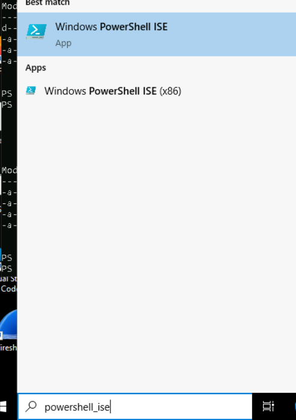

# Advanced Enumeration

We are going to use the [adsiSearcher] Type Accelerator
https://learn.microsoft.com/en-us/powershell/module/microsoft.powershell.core/about/about_type_accelerators?view=powershell-7.3

Type accelerators are aliases for .NET framework classes. They allow you to access specific .NET framework classes without having to explicitly type the entire class name.

- on every machine with no additional installs required

In addition, this is not logged in the process command line logging or by sysmon.

This can all be done as a domain user, no need for elevated privleges.  To prove that point we will use the felixb user who does not have any sort of admin groups assigned.

> **OPSEC NOTES**:
> - Not executing under powershell, powershell_ise can be used, we will explore a cool way this can be done.
> - Ideally these are ran in a custom CLR or "unmanaged powershell" within another process.
> - Authentication must be passed to gain the correct context if usin a proxy, and that is one more artifact.
> - We are very purposely avoiding loading any additional tools.
    - Tools have hardcoded behavior and artifacts that is signatureable
    - The tools themselves are often popped
    - New files, programs, or powershell modules is noisy


1. Remote from LIGHTEATER to the TWORIVERS.wheel.co machine using the wheel\felixb | pw: P@ssW0rD!  acount.  This only works if you are in the security context of a domain user.  If you have system, you can also inject into a domain users process to assume that context, or impersonate.
   
2. Use the start menu to open powershell_ise.exe we are going to explore a slightly different way to execute our commands using powershell_ise.  We opened it this way because it will show a different parent process, instead of launching it from cmd.exe or powershell.exe which is commonly inspected further by EDR.



3. In the powershell console, get the current domain with a DOTNET Class `[System.DirectoryServices.ActiveDirectory.Domain]::GetCurrentDomain()` this avoids things like nltest, which are indicators that detections key in on. 

4. Now use the $psise context to run commands in new tabs, each of which are completely separate powershell runspaces.

```powershell
$psISE.PowerShellTabs.Add()
$psISE.PowerShellTabs.SetSelectedPowerShellTab($psISE.PowerShellTabs[0])
$users = $psISE.PowerShellTabs[1].InvokeSynchronous("([adsisearcher]`'(&(objectCategory=user))`').findall()")
$users
$users | convertto-json
```

4. Do the same for computer objects.
```powershell
$psISE.PowerShellTabs.Add()
$psISE.PowerShellTabs.SetSelectedPowerShellTab($psISE.PowerShellTabs[0])
$computers = $psISE.PowerShellTabs[2].InvokeSynchronous("([adsisearcher]`'(&(objectCategory=Computer))`').findall()")
$computers
```

5. Do the same for users with service principal names objects.
```powershell
$psISE.PowerShellTabs.Add()
$psISE.PowerShellTabs.SetSelectedPowerShellTab($psISE.PowerShellTabs[0])
$servicepns = $psISE.PowerShellTabs[3].InvokeSynchronous("([adsisearcher]`'serviceprincipalname=*`').findall().properties.serviceprincipalname")
$servicepns
```
6. Do the same to get the full information for all of those users.
```powershell
$psISE.PowerShellTabs.Add()
$psISE.PowerShellTabs.SetSelectedPowerShellTab($psISE.PowerShellTabs[0])
$servicepnsdata = $psISE.PowerShellTabs[3].InvokeSynchronous("(([adsisearcher]`'serviceprincipalname=*`'`).findall().properties)")
$servicepnsdata
```


7. Previous enumeration reveals several domain users and computers with Service Principal Names (SPNs). To determine which accounts could be targeted for a kerberoasting attack, perform an LDAP query for all users assigned SPNs in order to generate a list of their SAM account names (this is needed later).  

```powershell
[string[]]$sams=([adsisearcher]"(&(objectCategory=user)(serviceprincipalname=*))").findall()|%{$_.properties["samaccountname"]};$sams
```


8. All of these command can be ran directly in powershell, the use of powershell_ise is not required, but can throw off some detections because the behavior is different.
   
   ```ps1
    ([adsisearcher]"objectcategory=user").findall()
    ([adsisearcher]"objectcategory=computer").findall()
    ([adsisearcher]"serviceprincipalname=*").findall().properties.serviceprincipalname
    (([adsisearcher]"serviceprincipalname=*").findall().properties) | fl
   ```
   
9. You can automate some of the collection using this foreach loop. But this will be louder, on the network as well.
 
    ```ps1
    $search = New-Object DirectoryServices.DirectorySearcher([ADSI]"") 
    $search.filter = "(&(servicePrincipalName=*)(objectCategory=user))" 
    $results = $search.Findall() 
    foreach ($results in $results) { $u = $results.GetDirectoryEntry(); $u.name; $u.samaccountname; foreach ($s in $u.servicePrincipalName) { $s; } Write-Host "---";}
    ```

