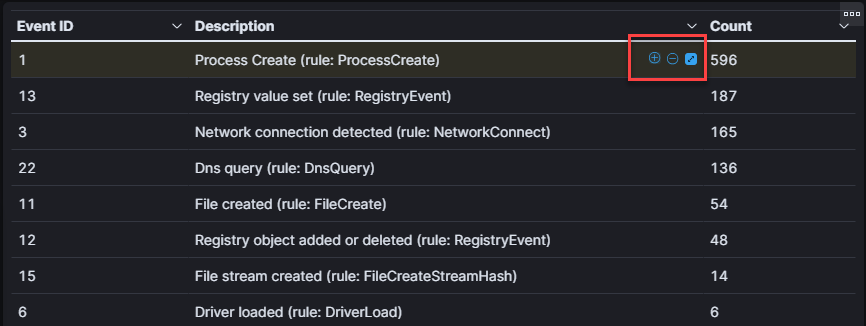

# Detecting Kerberoasting

Detecting Kerberoasting in an Active Directory environment is crucial to prevent attackers from exploiting Kerberos tickets, thereby safeguarding sensitive data and ensuring the integrity and security of enterprise networks.

For this section, we will be taking a different approach and using Elastic to filter through the data using some pre-built dashboards.

## Logging into Kibana

1. Open a browser on the client endpoint and navigate to: `http://172.31.24.42:5601`

2. Use the following credentials to log in:

> Username: `elastic`
>
> Password: `TheDestroyerOfWorlds`

3. Profit!

## Some Quick-Notes on Kibana

This will all be demonstrated live, but I'm adding it here to serve as a quick-reference.

Navigating between Kibana Apps (or views) can be done via the "hamberger" menu in the top-left.
- "Discover" will let you query all the logs
- "Dashboard" contains all the pre-built dashboards we'll be using

---

Filtering data in and out can be done my mousing over a value and clicking on the magnifying glass.

---

Ensure you are looking at the desired time range for your data! This can be changed by clicking the timeline box in the top-right.

## Analysis!

Using the same methods as the previous two sections, try filtering through the data to find the malicious activity you just performed. 

Dashboards have been pre-built for the Sysmon and Windows Security Event logs that you will need.

The only additional dataset is Windows Event ID 4769, Kerberos Service Ticket Request.

---

# Defensive Measures

Several methods can be effective as defensive measures against Kerberoasting in an Active Directory environment:

Use Strong Passwords for Service Accounts:
- Utilize long and complex passwords (25 characters or more) for service accounts. This makes it more difficult for attackers to brute force the ticket offline.

Regularly Rotate Service Account Passwords:
- Regularly changing service account passwords reduces the window of opportunity for an attacker even if they manage to retrieve a ticket.

Monitor for Suspicious Activity:
- Watch for numerous Kerberos Ticket Granting Service (TGS) requests. This might indicate a Kerberoasting attack in progress.
- Implement tools like Microsoft Advanced Threat Analytics (ATA) or similar technologies that can alert on these behaviors.

Implement Kerberos AES Encryption:
- Older RC4 encryption is more susceptible to Kerberoasting. Move to AES encryption, which is stronger and more resilient against these attacks. Ensure that service accounts support AES encryption.

Use Managed Service Accounts (MSAs):
- MSAs in Windows automatically manage password changes and use strong, complex passwords that are more resistant to brute-force attacks.

TGS Ticket Lifetime:
- Reduce the Ticket Granting Service (TGS) ticket lifetime. This minimizes the time window an attacker has to crack the ticket offline.